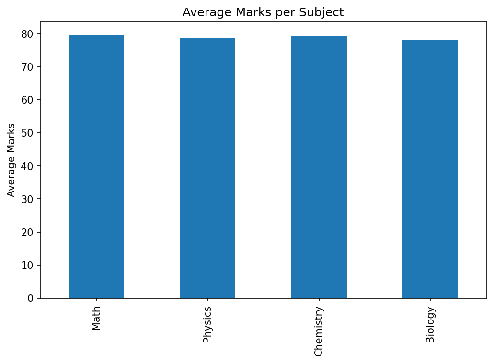
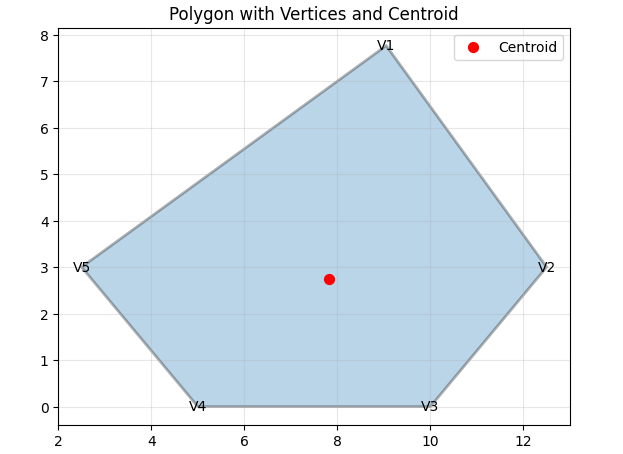
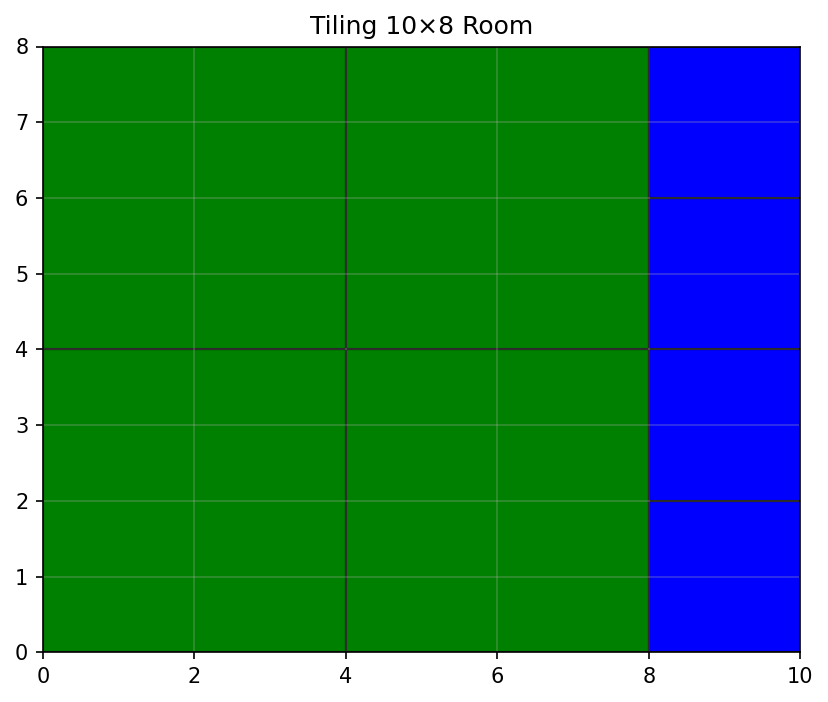
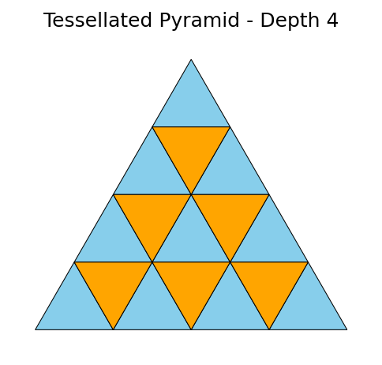

This repository contains solutions to the given Python assignments.

## Assignment 1a: Student Marks Analysis (Excel Automation) 
Result:

## Assignment 1b: Polygon Geometry using Vector Algebra
Result:

polygon_results.json

{
  "polygon_area_shoelace": 46.3,
  "polygon_area_shapely": 46.3,
  "edge_lengths": [
    5.878783887846192,
    3.905124837953327,
    5.0,
    3.905124837953327,
    8.096919167189457
  ],
  "interior_angles": [
    89.92765809834229,
    104.26020765837359,
    129.8055710922652,
    129.8055710922652,
    86.20099205875376
  ],
  "is_convex": true,
  "centroid_calculated": [
    7.81,
    2.752
  ],
  "centroid_shapely": [
    7.765586753059756,
    3.167660187185025
  ]
}

## Assignment 2: Room Tiling with Squares (Spiral Fill Visualization)
Result:

tiling_results.json

{
  "room_dimensions": [
    10,
    8
  ],
  "tiles": [
    {
      "x": 0,
      "y": 0,
      "size": 4,
      "color": "green"
    },
    {
      "x": 4,
      "y": 0,
      "size": 4,
      "color": "green"
    },
    {
      "x": 0,
      "y": 4,
      "size": 4,
      "color": "green"
    },
    {
      "x": 4,
      "y": 4,
      "size": 4,
      "color": "green"
    },
    {
      "x": 8,
      "y": 0,
      "size": 2,
      "color": "blue"
    },
    {
      "x": 8,
      "y": 2,
      "size": 2,
      "color": "blue"
    },
    {
      "x": 8,
      "y": 4,
      "size": 2,
      "color": "blue"
    },
    {
      "x": 8,
      "y": 6,
      "size": 2,
      "color": "blue"
    }
  ],
  "total_tiles": 8,
  "coverage_area": 80
}

## Assignment 3: Pyramid Building with Triangles
Result:

pyramid_results.json

{
  "depth": 4,
  "size": 2,
  "total_triangles": 10,
  "upright_triangles": 4,
  "inverted_triangles": 6
}
